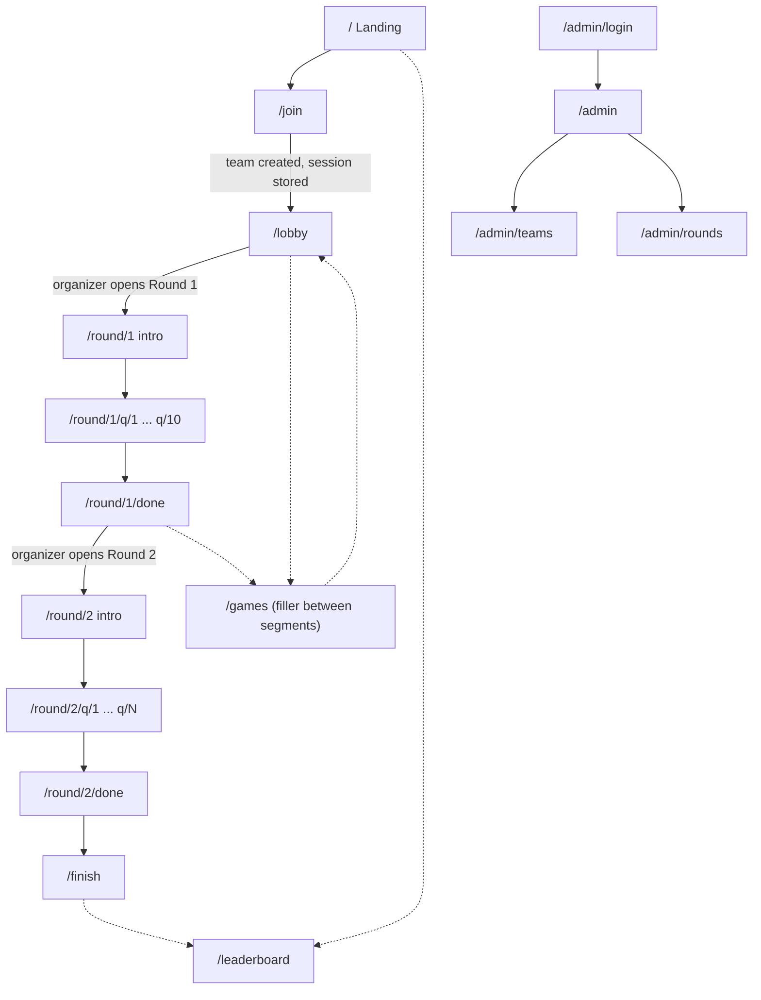

# SCAFFOLD_SPEC.md — Event Games Site (Blank Base)

> **Agent instructions:** Read this whole file before writing any code. Build the scaffold exactly as described. Do not ask clarifying questions. Where something is unspecified, pick the simplest option and leave a `// DECISION: <why>` comment. Do not build features. Every page is a **placeholder**.

---

## 1. What this task is (and is not)

**Is:** A blank, fully-routed, click-through-able base project. Every route, layout, folder, shared type, and API stub exists. Every page renders a placeholder. The whole participant flow can be clicked end to end with fake data.

**Is not:** Real UI, real questions, real backend calls, real game logic, or styling beyond bare tokens. Other teammates build those later, in parallel, in their own folders.

**Why it exists:** ~5 people will work asynchronously (no live syncs) over Tue–Fri. The scaffold must let frontend/backend pairs work on separate folders without git conflicts or guessing the pathway.

---

## 2. Product context (keep in mind, don't implement)

- Live event in an auditorium, seated, fixed rows. Audience of **200–500**, mostly 1st/2nd years, **multidisciplinary** (not just CS).
- Audience plays on **phones** (some laptops possible). Everything is **mobile-first**.
- Team-based play. Points are awarded **as you answer**. Public leaderboard + a separate **organizer-only** tracking view.
- **Round 1:** college trivia (10 questions).
- **Round 2:** logic/cipher puzzles (Caesar cipher, symbol substitution, rebus, sequences, riddles, odd-one-out, anagram).
- Optional filler: 1–2 mini web games between segments (route stubs only).
- Organizer controls round timing live (open/close rounds).

---

## 3. Stack (defaults — swap only if the repo already uses something else)

- Vite + React 18 + TypeScript
- React Router v6 (`createBrowserRouter`)
- Tailwind CSS (utility styling only; design tokens in `src/theme/tokens.css`)
- Supabase JS client (`@supabase/supabase-js`) — **initialized only, not called**
- ESLint + Prettier (config committed, so formatting never causes diff noise)
- Node 20+

---

## 4. Hard rules for the scaffold

1. **No real content.** No questions, no answers, no copy beyond placeholder labels.
2. **No backend calls.** All `shared/api/*` functions return hardcoded fake data with a `// TODO(backend)` marker.
3. **Answers never live in the client.** Question content files hold prompts/media/points only. Correct answers will be validated server-side (see section 9). Do not create any file containing answers.
4. **Mobile-first.** Base layout width 375px. Content container `max-width: 480px`, centered. Tap targets ≥ 44px. No hover-only interactions.
5. **One route table.** All routes are declared in `src/routes.tsx`. Pages never declare their own routes.
6. **Every page file starts with an owner header comment** (see section 8).
7. **Do not install extra dependencies** beyond section 3.
8. `npm run dev`, `npm run build`, `npm run lint`, and `tsc --noEmit` must all pass clean.

---

## 5. Route map

| Path | Page component | Layout | Guard | Purpose |
|---|---|---|---|---|
| `/` | `pages/Landing.tsx` | Participant | none | Event landing, "Join" button |
| `/join` | `pages/join/JoinPage.tsx` | Participant | none | Enter team name / code |
| `/lobby` | `pages/lobby/LobbyPage.tsx` | Participant | RequireTeam | Waiting room until organizer opens a round |
| `/round/:roundId` | `pages/rounds/RoundIntro.tsx` | Participant | RequireTeam | Round intro / rules (shared shell for all rounds) |
| `/round/1/q/:qNum` | `pages/rounds/round1/Round1Question.tsx` | Participant | RequireTeam | Round 1 question screen |
| `/round/1/done` | `pages/rounds/round1/Round1Done.tsx` | Participant | RequireTeam | Round 1 summary |
| `/round/2/q/:qNum` | `pages/rounds/round2/Round2Question.tsx` | Participant | RequireTeam | Round 2 puzzle screen |
| `/round/2/done` | `pages/rounds/round2/Round2Done.tsx` | Participant | RequireTeam | Round 2 summary |
| `/games` | `pages/games/GameHub.tsx` | Participant | RequireTeam | Filler mini-games list |
| `/games/:gameId` | `pages/games/GameShell.tsx` | Participant | RequireTeam | Mounts a single mini-game |
| `/leaderboard` | `pages/leaderboard/LeaderboardPage.tsx` | Participant | none | Public leaderboard |
| `/finish` | `pages/finish/FinishPage.tsx` | Participant | RequireTeam | Final score + rank |
| `/screen` | `pages/screen/BigScreenLeaderboard.tsx` | Bare (no layout) | none | Projector-friendly leaderboard (optional, stub only) |
| `/admin/login` | `pages/admin/AdminLogin.tsx` | Bare | none | Organizer login |
| `/admin` | `pages/admin/AdminDashboard.tsx` | Admin | RequireAdmin | Overview |
| `/admin/teams` | `pages/admin/AdminTeams.tsx` | Admin | RequireAdmin | Per-team progress tracking (organizer only) |
| `/admin/rounds` | `pages/admin/AdminRoundControl.tsx` | Admin | RequireAdmin | Open/close rounds, set current round |
| `/__routes` | `pages/dev/RouteIndex.tsx` | Bare | dev only | Lists every route above as clickable links |
| `*` | `pages/NotFound.tsx` | Participant | none | 404 |

`/__routes` must only be registered when `import.meta.env.DEV` is true.

---

## 6. User flow



**Flow rules to encode in the stubs:**
- Solid arrows = the main path. Each placeholder page shows a **"Next →"** button that follows this path, so the full flow is clickable with fake data.
- Dotted arrows = side links available from a persistent participant nav (Leaderboard, Games).
- Round progression is **organizer-gated**: participants sit in `/lobby` (or between rounds) until `event_state.current_round` changes. Stub this as a fake value from `shared/api/rounds.ts`; do not implement realtime.
- Question count per round comes from `shared/constants.ts` (`ROUND_QUESTION_COUNT`): Round 1 = 10, Round 2 = 10 (placeholder until content is final).

---

## 7. Folder structure

Create exactly this. Empty folders get a `.gitkeep`.

```
/
├─ SCAFFOLD_SPEC.md
├─ README.md                      # generate: run instructions + section 8 ownership table
├─ .env.example                   # VITE_SUPABASE_URL=, VITE_SUPABASE_ANON_KEY=
├─ .gitignore                     # include .env
├─ .prettierrc  .eslintrc.cjs
├─ CODEOWNERS                     # see section 10
├─ vercel.json                    # SPA fallback rewrite to /index.html (harmless if unused)
├─ index.html                     # viewport meta: width=device-width, initial-scale=1
├─ package.json  vite.config.ts  tsconfig.json  tailwind.config.js  postcss.config.js
├─ supabase/
│  ├─ migrations/.gitkeep         # backend owners
│  └─ seed/.gitkeep               # backend owners (questions + answers live here, server-side only)
└─ src/
   ├─ main.tsx
   ├─ App.tsx                     # renders <RouterProvider/> only
   ├─ routes.tsx                  # THE route table (section 5)
   ├─ layouts/
   │  ├─ ParticipantLayout.tsx    # mobile shell: top bar, <Outlet/>, bottom nav (Lobby/Games/Leaderboard)
   │  └─ AdminLayout.tsx          # simple sidebar + <Outlet/>
   ├─ guards/
   │  ├─ RequireTeam.tsx          # redirect to /join if no session
   │  └─ RequireAdmin.tsx         # redirect to /admin/login if no admin flag (stub)
   ├─ shared/                     # CONTRACTS — changes require PR review (section 10)
   │  ├─ types.ts
   │  ├─ constants.ts
   │  ├─ session.ts               # localStorage session, try/catch wrapped
   │  └─ api/
   │     ├─ index.ts              # re-exports
   │     ├─ teams.ts
   │     ├─ rounds.ts
   │     ├─ questions.ts
   │     ├─ answers.ts
   │     ├─ leaderboard.ts
   │     └─ admin.ts
   ├─ lib/
   │  └─ supabase.ts              # createClient only; reads env; not imported by pages yet
   ├─ content/
   │  ├─ round1.questions.ts      # typed empty array: prompts/media/points only, NO answers
   │  └─ round2.questions.ts      # same
   ├─ components/
   │  ├─ Placeholder.tsx          # see section 8
   │  └─ ui/.gitkeep              # frontend/UI owner fills
   ├─ theme/
   │  └─ tokens.css               # CSS variables: colors, spacing, radius, font; light/dark
   └─ pages/
      ├─ Landing.tsx
      ├─ NotFound.tsx
      ├─ join/JoinPage.tsx
      ├─ lobby/LobbyPage.tsx
      ├─ rounds/
      │  ├─ RoundIntro.tsx
      │  ├─ round1/{Round1Question.tsx, Round1Done.tsx}
      │  └─ round2/{Round2Question.tsx, Round2Done.tsx}
      ├─ games/
      │  ├─ GameHub.tsx
      │  ├─ GameShell.tsx
      │  └─ registry.ts           # map gameId -> lazy component; starts with empty entries
      ├─ leaderboard/LeaderboardPage.tsx
      ├─ finish/FinishPage.tsx
      ├─ screen/BigScreenLeaderboard.tsx
      ├─ admin/{AdminLogin.tsx, AdminDashboard.tsx, AdminTeams.tsx, AdminRoundControl.tsx}
      └─ dev/RouteIndex.tsx
```

**Isolation principle:** each round has its own folder and its own content file, so two pairs can build Round 1 and Round 2 simultaneously without ever touching the same file.

---

## 8. Placeholder pattern

`components/Placeholder.tsx` props: `{ title, path, area, owner?, next?: { label, to }, notes?: string }`

It renders: the page title, the route path, the **area** (e.g. `rounds/round1`), an owner line (`TBD`), an optional "Next →" link, and a dashed border so it's obviously unfinished.

**Every page file starts with this header** (adjust per file):

```tsx
/**
 * AREA: rounds/round1
 * OWNER: TBD            // fill in name
 * STATUS: placeholder
 * TODO(frontend): real UI for Round 1 question screen
 * TODO(backend): submitAnswer() wiring via shared/api/answers.ts
 */
```

Use `TODO(frontend)`, `TODO(backend)`, or `TODO(content)` so teammates can grep their own work: `grep -r "TODO(backend)" src`.

**Ownership areas** (fill owner names in README; roles only here):

| Area | Folders | Role |
|---|---|---|
| Scaffold / template | `routes.tsx`, `layouts/`, `guards/`, `components/Placeholder.tsx`, config files | Web template |
| UI design | `components/ui/`, `theme/`, visual layer of every page | Frontend (UI) |
| Backend + Supabase | `supabase/`, `lib/supabase.ts`, `shared/api/*` implementations | Backend (x2) |
| Backend + integrations | Answer validation, scoring, leaderboard aggregation, any third-party hooks | Backend (integrations) |
| Round 1 | `pages/rounds/round1/`, `content/round1.questions.ts` | Pair A |
| Round 2 | `pages/rounds/round2/`, `content/round2.questions.ts` | Pair B |
| Admin/organizer | `pages/admin/` | Pair C |
| Filler games | `pages/games/` | Whoever has capacity |

---

## 9. Shared contracts (write these fully; they're the interface between pairs)

### `shared/types.ts`

```ts
export type RoundId = 1 | 2;

export type QuestionType =
  | 'mcq' | 'text'                                   // round 1
  | 'cipher' | 'symbol-substitution' | 'rebus'
  | 'sequence' | 'riddle' | 'odd-one-out' | 'anagram'; // round 2

export interface Question {
  id: string;
  roundId: RoundId;
  qNum: number;               // 1-based
  type: QuestionType;
  prompt: string;
  options?: string[];         // for mcq / odd-one-out
  mediaUrl?: string;          // image for rebus / symbols
  points: number;
  // NOTE: no `answer` field. Ever. Validation is server-side.
}

export interface Team {
  id: string;
  name: string;
  code: string;               // short join code
  createdAt: string;
}

export interface AnswerResult {
  correct: boolean;
  pointsAwarded: number;
  totalPoints: number;
}

export interface LeaderboardEntry {
  rank: number;
  teamId: string;
  teamName: string;
  points: number;
}

export type RoundStatus = 'locked' | 'open' | 'closed';

export interface EventState {
  currentRound: RoundId | null;   // null = lobby
  roundStatus: Record<RoundId, RoundStatus>;
}

export interface TeamProgress {   // organizer-only view
  teamId: string;
  teamName: string;
  currentRound: RoundId | null;
  currentQNum: number | null;
  answered: number;
  correct: number;
  points: number;
  lastActiveAt: string;
}

export interface Session {
  teamId: string;
  teamName: string;
  isAdmin?: boolean;
}
```

### `shared/constants.ts`

- `ROUTES` object with a path-builder for every route in section 5 (e.g. `ROUTES.roundQuestion(1, 3)` → `/round/1/q/3`). **Pages must use these, never hardcoded path strings.**
- `ROUND_QUESTION_COUNT: Record<RoundId, number> = { 1: 10, 2: 10 }`
- `LEADERBOARD_POLL_MS = 8000`

### `shared/api/*` stub signatures (return fake data now, `// TODO(backend)`)

```ts
// teams.ts
joinTeam(name: string, code?: string): Promise<Team>
// rounds.ts
getEventState(): Promise<EventState>
// questions.ts
getQuestion(roundId: RoundId, qNum: number): Promise<Question>   // strips answers server-side
// answers.ts
submitAnswer(roundId: RoundId, qNum: number, response: string): Promise<AnswerResult>
// leaderboard.ts
getLeaderboard(limit?: number): Promise<LeaderboardEntry[]>
// admin.ts
getAllTeamProgress(): Promise<TeamProgress[]>
setRoundStatus(roundId: RoundId, status: RoundStatus): Promise<EventState>
```

### `shared/session.ts`

`getSession()`, `setSession(s)`, `clearSession()` — localStorage, **every access wrapped in try/catch**, returns `null` when empty or unavailable.

### Guards

- `RequireTeam`: no session → `<Navigate to="/join" replace />`.
- `RequireAdmin`: no `session.isAdmin` → `<Navigate to="/admin/login" replace />`. Stub `AdminLogin` sets `isAdmin: true` on any click (real auth is backend's job).

### Backend notes for later (do NOT implement; put in README)

- Suggested tables: `teams`, `event_state`, `questions` (includes `answer`, **not readable by anon**), `submissions`, and a `leaderboard` view.
- Answer checking goes through a Supabase RPC or edge function (`submit_answer`), never client-side comparison.
- Participant leaderboard should **poll** (`LEADERBOARD_POLL_MS`), not open a realtime channel per phone. Reserve realtime for the organizer view. Backend owners: check the concurrent-connection limits on your Supabase plan against a 500-person audience.

---

## 10. Git and collaboration setup

Generate these so nobody steps on anyone:

1. **`CODEOWNERS`** mapping folders to the areas in section 8 (use `@TBD` handles).
2. **README "Working agreement" section** containing:
   - `main` is the scaffold. Branch per area: `feat/round1`, `feat/round2`, `feat/admin`, `feat/backend`, `feat/ui`.
   - Only touch files inside your own area's folders.
   - `routes.tsx`, `shared/`, `layouts/`, `guards/`, and `package.json` are **scaffold-owner territory**. Need a new route, type, or dependency? Open a tiny PR or ask, don't edit in place.
   - `git pull --rebase origin main` before starting work and before every push. Small, frequent commits.
   - No reformat-only commits (Prettier config is committed; use format-on-save).
   - Never commit `.env`.
3. **Prettier + ESLint configs** committed, with `npm run lint` and `npm run format` scripts.

---

## 11. Acceptance checklist

The scaffold is done when all of these are true:

- [ ] `npm install && npm run dev` starts cleanly.
- [ ] `npm run build`, `npm run lint`, and `tsc --noEmit` pass with zero errors.
- [ ] Every route in section 5 resolves and renders a `Placeholder` showing its path, area, and owner.
- [ ] `/__routes` (dev only) lists every route as a clickable link.
- [ ] The full participant flow is clickable via "Next →": `/` → `/join` → `/lobby` → `/round/1` → `/round/1/q/1` … `q/10` → `/round/1/done` → `/round/2` → … → `/round/2/done` → `/finish`.
- [ ] Deep-linking (refresh on `/round/1/q/3`) works in dev and has an SPA fallback for deploy.
- [ ] Guards work: hitting `/lobby` with no session redirects to `/join`; `/admin` without the admin flag redirects to `/admin/login`.
- [ ] Layout is usable at 375px width; no horizontal scroll.
- [ ] Every page file has the owner header comment; `grep -r "TODO(backend)" src` returns results.
- [ ] No file anywhere contains question answers.
- [ ] README explains how to run, the folder ownership table, and the working agreement.
- [ ] No dependencies beyond section 3.

**When finished:** print a short summary listing anything under `// DECISION:` so the human can review it.